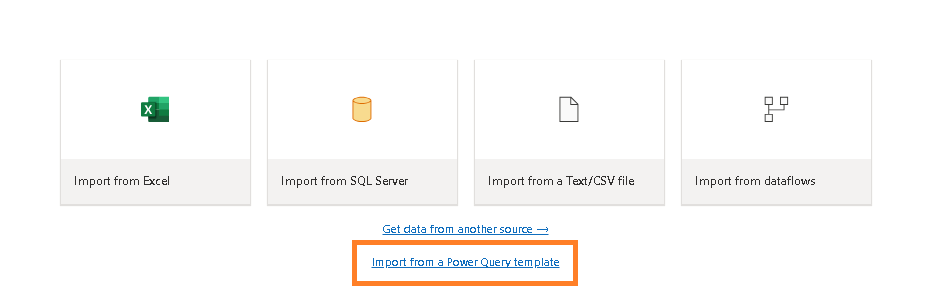
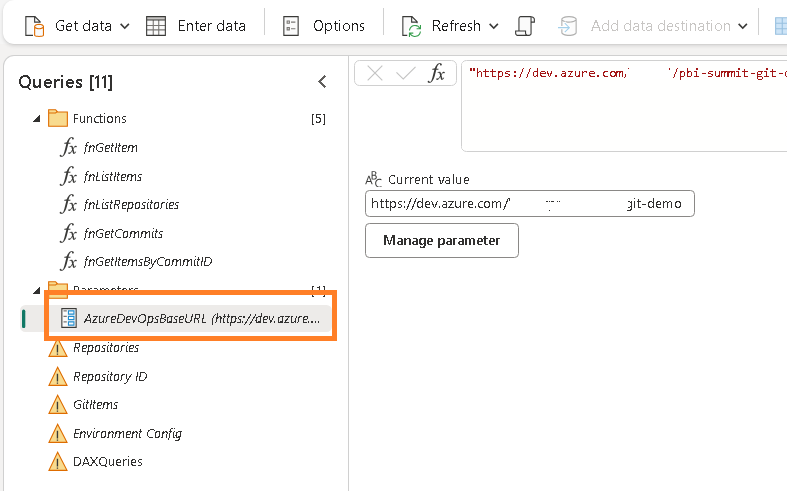
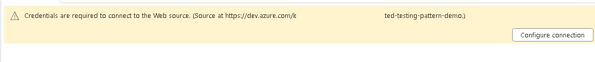
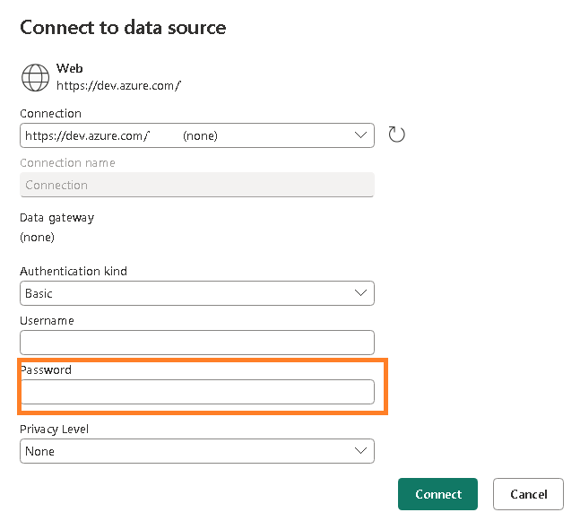
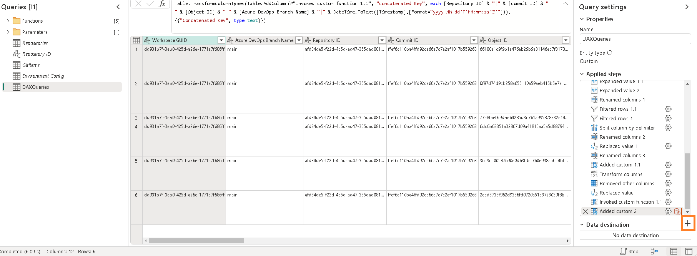
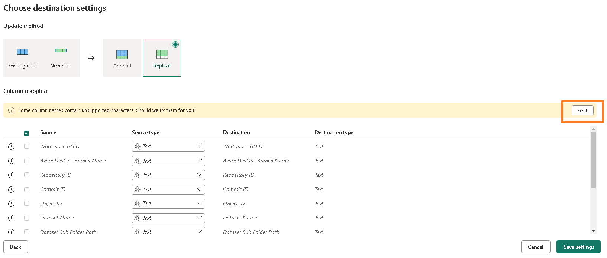

# Gen2, Notebook Automated Testing Pattern

Sample files for:

1. Gen2 Dataflow to Retrieve DAX Queries stored in Azure DevOps
2. Fabric Notebook that uses semantic-link to run DAX Queries.


# Gen2 Dataflow Example

## Prerequisites

### Fabric Workspace

 - You must have a <a href="https://learn.microsoft.com/en-us/fabric/get-started/workspaces" target="_blank">workspace in Fabric</a>.

#### Setup Lakehouse

1. In your Fabric workspace, create a Lakehouse.  Instructions can be found <a href="https://learn.microsoft.com/en-us/fabric/onelake/create-lakehouse-onelake#create-a-lakehouse" target="_blank">at this link.</a>

#### Setup Dataflow Gen2

1. Create a Personal Access Token in Azure DevOps. Instructions can be found <a href="https://learn.microsoft.com/en-us/azure/devops/organizations/accounts/use-personal-access-tokens-to-authenticate?view=azure-devops&tabs=Windows#create-a-pat" target="_blank">at this link.</a> Copy it to your Notepad for later.  *Note: It is good to send a reminder in Outlook a week before the date the token expires.*
1. Copy the URL to the project in Azure DevOps to Notepad.  The format should be something like: ```https://dev.azure.com/{Organization Name}/{Project Name}```
1. In the Fabric Workspace, create a Dataflow Gen2 dataflow using <a href="API - Azure DevOps Latest DAX Queries - Bronze.pqt" target="_blank">this template.</a>

1. In the dataflow, update the AzureDevOpsBaseURL parameter with the URL you copied in the prior Azure DevOps step.

1. Click on the Respositories table and click on the "Configure Connection" button.

1. Using Basic Authentication, enter the Personal Access Token you copied in the prior Azure DevOps step into the Password field.  Leave the Username blank.

1. Click on the DAXQueries table and select plus sybmol above the "No data destination" message. Select the "Lakehouse" option.

1. Connect to the Lakehouse you created in the workspace in the prior step. 
1. In the destination settings, choose the Fix Option and Save Settings.

1. Publish the dataflow and verify it refreshes.


# Fabric Notebook

[Sample Notebook](./Run%20DQV%20Tests.ipynb)